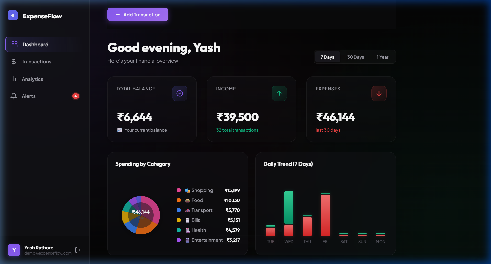

# 💸 ExpenseFlow — Smart Expense Tracker

A full-stack, production-ready personal finance tracker built with **Node.js**, **Express**, **MongoDB**, and a premium dark-mode UI.

**[🚀 View Live Demo](https://expense-tracker-v2-pearl.vercel.app/)**



---

## ✨ Features

| Feature | Description |
|---|---|
| 🔐 **JWT Authentication** | Secure register / login with HTTP-only cookies + Bearer token |
| 📊 **Live Dashboard** | Balance, income & expense stats with rolling 7 / 30 / 365-day filters |
| 💸 **Transactions** | Add, edit, delete income & expense entries across 12 categories |
| 📈 **Analytics** | Donut chart, bar chart trends, category breakdown & savings rate |
| 🔔 **Smart Alerts** | Auto-generated financial warnings based on your spending patterns |
| 📱 **Fully Responsive** | Laptop, tablet & mobile — with a native-style bottom navigation bar |
| 🌱 **Demo Seed Script** | One command to populate 3 months of realistic demo data |

---

## 🖥️ Tech Stack

**Backend**
- Node.js + Express 4
- MongoDB + Mongoose 8
- JSON Web Tokens (jsonwebtoken)
- bcryptjs password hashing
- cookie-parser, cors, dotenv

**Frontend**
- Vanilla HTML5 / CSS3 / JavaScript (no frameworks)
- Google Fonts — Outfit + Plus Jakarta Sans
- Custom SVG charts (no chart library dependency)
- Glassmorphism dark theme with micro-animations

---

## 🚀 Quick Start

### Prerequisites
- [Node.js](https://nodejs.org/) v18+
- [MongoDB](https://www.mongodb.com/try/download/community) running locally **or** a [MongoDB Atlas](https://www.mongodb.com/cloud/atlas) connection string

### 1. Clone the repo
```bash
git clone https://github.com/YashRajcode04/expense_tracker_v2.git
cd expense_tracker_v2
```

### 2. Install dependencies
```bash
npm install
```

### 3. Configure environment variables
```bash
cp .env.example .env
```
Edit `.env` and fill in your values:
```env
PORT=5000
MONGODB_URI=mongodb://localhost:27017/expense-tracker
JWT_SECRET=your_super_secret_jwt_key_here
```

### 4. (Optional) Seed demo data
```bash
node seed.js
```
This creates a demo user with **69 realistic transactions** across 3 months:
```
Email:    demo@expenseflow.com
Password: demo1234
```

### 5. Start the server
```bash
# Development (auto-restarts on file changes)
npm run dev

# Production
npm start
```

Open **http://localhost:5000** in your browser.

---

## 📁 Project Structure

```
expense_tracker_v2/
│
├── middleware/
│   └── auth.js           # JWT authentication middleware
│
├── models/
│   ├── User.js           # Mongoose user schema
│   └── Expense.js        # Mongoose expense/income schema
│
├── public/
│   ├── index.html        # Single-page app shell
│   ├── style.css         # Full responsive dark-mode CSS
│   └── app.js            # Frontend logic (auth, charts, alerts)
│
├── routes/
│   ├── auth.js           # Register, login, logout, /me, profile
│   └── expenses.js       # CRUD + stats + smart alerts API
│
├── .env.example          # Environment variable template
├── seed.js               # Demo data seed script
├── server.js             # Express app entry point
└── package.json
```

---

## 🔌 API Reference

### Auth
| Method | Endpoint | Description |
|---|---|---|
| `POST` | `/api/auth/register` | Create a new account |
| `POST` | `/api/auth/login` | Login and receive JWT |
| `POST` | `/api/auth/logout` | Clear auth cookie |
| `GET` | `/api/auth/me` | Get current user |

### Expenses
| Method | Endpoint | Description |
|---|---|---|
| `GET` | `/api/expenses` | List transactions (filterable) |
| `POST` | `/api/expenses` | Add a transaction |
| `PUT` | `/api/expenses/:id` | Update a transaction |
| `DELETE` | `/api/expenses/:id` | Delete a transaction |
| `GET` | `/api/expenses/stats?period=month` | Dashboard stats (7/30/365 days) |
| `GET` | `/api/expenses/alerts` | Smart financial alerts |

### Query Parameters for `GET /api/expenses`
| Param | Values | Description |
|---|---|---|
| `type` | `income` / `expense` | Filter by type |
| `category` | e.g. `food`, `salary` | Filter by category |
| `startDate` | ISO date string | Range filter start |
| `endDate` | ISO date string | Range filter end |
| `limit` | number (default 50) | Pagination limit |
| `page` | number (default 1) | Pagination page |

---

## 🔔 Smart Alerts System

The `/api/expenses/alerts` endpoint analyses your last 30 days vs the previous 30 days and generates:

- 🔴 **Critical** — Spending exceeds income, no income recorded
- 🟡 **Warnings** — Low savings rate (<20%), spending spike (>40% up), category overspend
- 🔵 **Tips** — Large single transactions, entertainment budget exceeded
- 🟢 **Good News** — Excellent savings rate (≥40%), spending down vs last period

---

## 🌱 Expense Categories

**Expense:** `food` · `transport` · `entertainment` · `shopping` · `bills` · `health` · `education` · `other`

**Income:** `salary` · `freelance` · `investment` · `gift` · `other`

---

---

## ☁️ Deployment to Vercel

This project is configured for easy deployment to **Vercel** as a serverless function.

### Steps:

1. **Push to GitHub**:
   Ensure your code is pushed to a GitHub repository.

2. **Connect to Vercel**:
   - Go to [Vercel Dashboard](https://vercel.com/dashboard).
   - Click **"Add New"** > **"Project"**.
   - Import your GitHub repository.

3. **Configure Environment Variables**:
   In the Vercel project settings during import, add the following environment variables:
   - `MONGODB_URI`: Your MongoDB Atlas connection string (Localhost will NOT work).
   - `JWT_SECRET`: A secure random string for signing tokens.
   - `VERCEL`: Set to `true` (This is used by `server.js` to optimize for serverless).

4. **Deploy**:
   - Click **"Deploy"**. Vercel will use the `vercel.json` file to configure the build and routes automatically.

> **Note:** Since this app uses MongoDB, you must use a cloud-hosted database like [MongoDB Atlas](https://www.mongodb.com/cloud/atlas). Make sure to whitelist `0.0.0.0/0` in Atlas IP Access List or use Vercel's fixed IP if applicable.

---

## 🤝 Contributing


1. Fork the repo
2. Create a feature branch: `git checkout -b feature/my-feature`
3. Commit your changes: `git commit -m "Add my feature"`
4. Push to the branch: `git push origin feature/my-feature`
5. Open a Pull Request

---

## 📄 License

MIT License — feel free to use, modify, and distribute.

---


